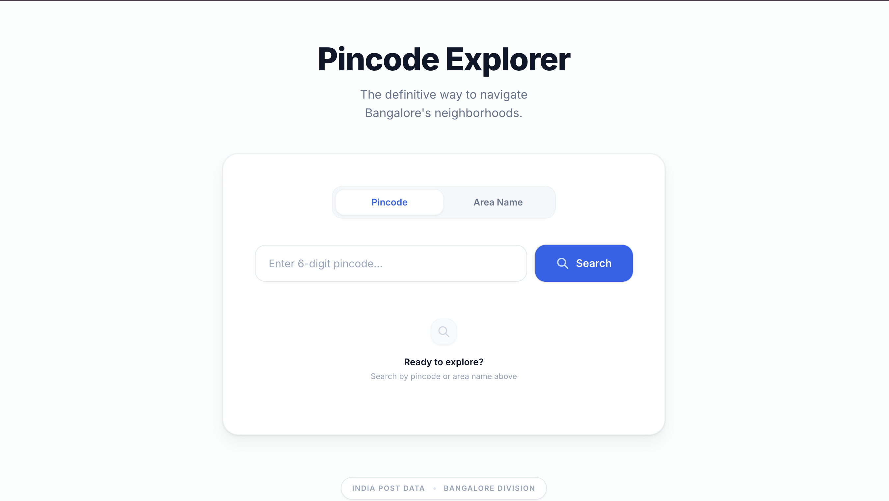
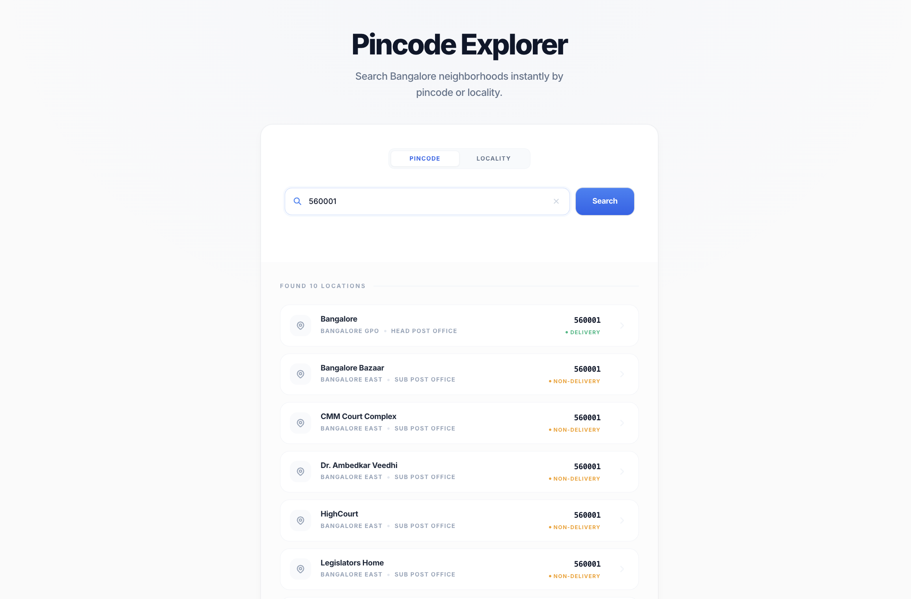
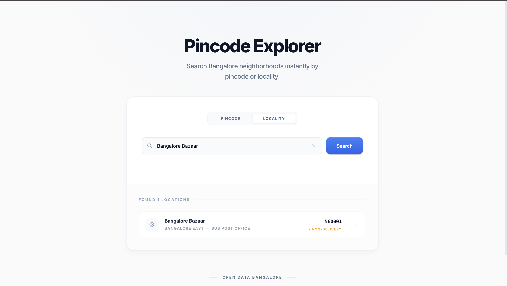

A full-stack web application to explore Bangalore pincodes and areas.
Search by pincode to get area details, or search by area name to find the pincode.

---


## ✨ Features

- Search by **Pincode** → get all post offices and areas for that pincode
- Search by **Area Name** → get pincode and office details for that area
- Bangalore-only filtering (results filtered to Bangalore/Bengaluru district)
- Input validation with clear error messages
- Responsive UI that works on mobile and desktop
- Fast search with loading state
- Clean, modern UI built with Tailwind CSS

---

## 🛠️ Tech Stack

### Frontend
| Tech | Purpose |
|---|---|
| React.js | UI framework |
| Tailwind CSS | Styling |
| Fetch API | HTTP requests to backend |

### Backend
| Tech | Purpose |
|---|---|
| Node.js | Runtime |
| Express.js | Web server framework |
| Axios | External API calls |
| CORS | Cross-origin requests |
| Nodemon | Dev auto-restart |

### Data Source
| Source | Purpose |
|---|---|
| [PostalPincode API](https://api.postalpincode.in) | Free India Post data, no auth required |

---

## 📁 Folder Structure

```
bangalore-pincode-explorer/
├── client/                     # React frontend
│   ├── public/
│   └── src/
│       ├── components/
│       │   ├── Toggle.jsx      # Pincode / Area mode switcher
│       │   ├── SearchBar.jsx   # Input + Search button
│       │   └── ResultsTable.jsx # Results display
│       ├── App.jsx             # Main app logic
│       ├── index.js            # React entry point
│       └── index.css           # Tailwind imports
├── server/                     # Express backend
│   ├── index.js                # All API routes
│   ├── .env                    # Environment variables
│   └── package.json
├── data/                       # Local JSON fallback
└── README.md
```

---

## 📡 API Endpoints

### Base URL (local): `http://localhost:8000`

#### 1. Search by Pincode
```
GET /api/pincode/:pin
```

| Parameter | Type | Example |
|---|---|---|
| `pin` | 6-digit number | `560001` |

**Success Response:**
```json
{
  "success": true,
  "count": 3,
  "areas": [
    {
      "Name": "Koramangala S.O",
      "BranchType": "Sub Post Office",
      "DeliveryStatus": "Delivery",
      "Division": "Bangalore South",
      "District": "Bangalore",
      "State": "Karnataka"
    }
  ]
}
```

**Error Response:**
```json
{
  "success": false,
  "message": "Not a Bangalore pincode. Bangalore pincodes start with 56."
}
```

---

#### 2. Search by Area Name
```
GET /api/area/:name
```

| Parameter | Type | Example |
|---|---|---|
| `name` | string | `Koramangala` |

**Success Response:**
```json
{
  "success": true,
  "count": 2,
  "areas": [
    {
      "Name": "Koramangala S.O",
      "PINCode": "560034",
      "BranchType": "Sub Post Office",
      "DeliveryStatus": "Delivery",
      "Division": "Bangalore South",
      "District": "Bangalore",
      "State": "Karnataka"
    }
  ]
}
```

**Error Response:**
```json
{
  "success": false,
  "message": "No Bangalore areas found for this name."
}
```

---

## 🚀 Run Locally

### Prerequisites
- Node.js v16+
- npm

### 1. Clone the repository
```bash
git clone https://github.com/YOUR_USERNAME/bangalore-pincode-explorer.git
cd bangalore-pincode-explorer
```

### 2. Start the Backend
```bash
cd server
npm install
npm run dev
```
Backend runs on → `http://localhost:8000`

### 3. Start the Frontend
Open a new terminal tab:
```bash
cd client
npm install
npm start
```
Frontend runs on → `http://localhost:3000`

---

## 🧪 Test Cases

| Input | Mode | Expected Result |
|---|---|---|
| `560001` | Pincode | List of Bangalore post offices |
| `560034` | Pincode | Koramangala area offices |
| `Koramangala` | Area | Matching offices with pincodes |
| `Indiranagar` | Area | Matching offices with pincodes |
| `110001` | Pincode | Error: Not a Bangalore pincode |
| `abc` | Pincode | Error: Invalid pincode format |
| ` ` (empty) | Both | Error: Validation message |

---


### Home Page


### Search by Pincode


### Search by Area


---

## 🙋‍♀️ Author

**Tanisha**
- GitHub: [@Tanisha800](https://github.com/Tanisha800)

## 🙏 Acknowledgements

- [India Post](https://www.indiapost.gov.in/) for postal data
- [PostalPincode API](http://www.postalpincode.in/) for the free API
